# 🛡️ AI Squadron AML: Anti-Money Laundering Detection System

[](https://python.org)
[](https://aws.amazon.com/)
[](https://langchain.com/langgraph)
[](LICENSE)
 
> **AI Squadron: Coordinated Multi-Agent AML Detection System**

An Anti-Money Laundering (AML) detection system that deploys a **squadron of specialized AI agents** working together through **Multi-Agent Orchestration** and **Semantic Reasoning** to identify suspicious financial activities. Built on AWS cloud infrastructure with LangGraph workflow orchestration for scalable, intelligent detection.

## 🌟 **System Overview**

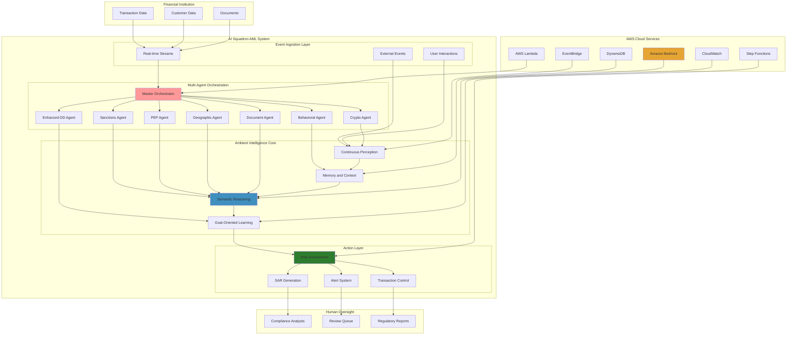

## 🔬 **AI Squadron Intelligence Architecture**

Our AI Squadron implements the **Seven Principles of Ambient Intelligence** with coordinated multi-agent collaboration to create a truly intelligent AML detection platform:

### 🎯 **1. Goal-Oriented Operation**
- **Primary Objective**: Detect suspicious activities while minimizing false positives
- **Adaptive Goals**: Dynamic threshold adjustment based on regulatory changes
- **Performance Optimization**: Continuous improvement of detection accuracy

### 🤖 **2. Autonomous Decision Making**
- **Independent Analysis**: Agents make decisions without human intervention for routine cases
- **Risk-Based Automation**: Automatic approval for low-risk transactions
- **Escalation Logic**: Smart escalation to human analysts for complex cases

### 👁️ **3. Continuous Perception**
- **Real-Time Monitoring**: 24/7 transaction stream processing
- **Multi-Source Integration**: External data feeds, sanctions lists, news feeds
- **Environmental Awareness**: Market conditions, regulatory updates, threat intelligence

### 🧠 **4. Semantic Reasoning**
- **Contextual Understanding**: LLM-powered analysis beyond simple rule matching
- **Pattern Recognition**: Advanced detection of complex money laundering schemes
- **Natural Language Processing**: Document analysis and narrative understanding

### 💾 **5. Persistent Memory**
- **Cross-Transaction Context**: Maintains history across multiple interactions
- **Learning Accumulation**: Builds knowledge from past investigations
- **Pattern Memory**: Remembers successful detection patterns

### 🤝 **6. Squadron Collaboration**
- **Specialized Expertise**: Each agent in the squadron focuses on specific AML domains
- **Information Sharing**: Seamless data exchange between squadron members
- **Collective Intelligence**: Combined squadron insights exceed individual agent capabilities

### 📡 **7. Asynchronous Communication**
- **Event-Driven Architecture**: Loose coupling through event streams
- **Fault Tolerance**: System resilience through distributed communication
- **Scalable Processing**: Handle high-volume transaction loads

## 🚀 **Core Features**

### **🔍 Detection Capabilities**
- **Structuring & Smurfing Detection**: Pattern recognition for transaction structuring
- **Trade-Based Money Laundering**: Invoice analysis and document fraud detection
- **Cryptocurrency Analysis**: Blockchain analysis and mixer detection
- **Cross-Border Risk Assessment**: Multi-jurisdiction compliance screening
- **Behavioral Analytics**: Customer behavior analysis and velocity monitoring

### **⚡ Real-Time Processing**
- **Stream Processing**: Real-time transaction analysis
- **Streaming Architecture**: Kafka/Kinesis integration for data ingestion
- **Parallel Processing**: Multi-threaded agent execution
- **Auto-scaling**: Dynamic scaling based on transaction volume

### **🎨 Explainable AI**
- **Decision Transparency**: Clear reasoning for every alert and decision
- **Audit Trail**: Complete workflow tracking for regulatory compliance
- **Evidence Documentation**: Structured evidence collection and presentation
- **Risk Factor Attribution**: Detailed breakdown of risk score components

## 🏗️ **LangGraph Multi-Agent Workflow**

The system uses **LangGraph** to orchestrate a sophisticated multi-agent workflow that adapts based on transaction characteristics and risk factors.

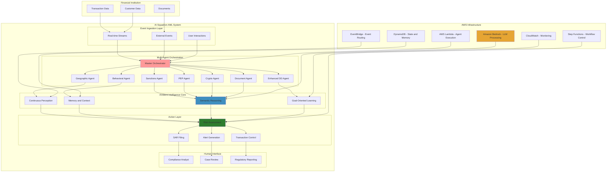

### **🤖 Agent Capabilities**

| Agent | Focus Area | Key Functions |
|-------|------------|---------------|
| **🎪 Orchestrator** | Workflow Coordination | Initial assessment, routing logic, overall coordination |
| **⚖️ Sanctions** | Compliance Screening | Entity screening, sanctions list matching, compliance verification |
| **👑 PEP** | Political Exposure | Politically exposed person detection, risk categorization |
| **🌍 Geographic** | Jurisdictional Risk | Country risk assessment, routing analysis, sanctions compliance |
| **🔄 Behavioral** | Pattern Analysis | Structuring detection, velocity analysis, behavior changes |
| **BTC Crypto** | Digital Assets | Mixer detection, blockchain analysis, privacy coin screening |
| **📄 Document** | Trade Analysis | Invoice analysis, document fraud, trade-based laundering |
| **🔍 Enhanced DD** | Deep Investigation | Comprehensive analysis, source of funds, beneficial ownership |

## ☁️ **AWS Cloud Architecture**

Built for enterprise scale with a comprehensive AWS cloud-native architecture leveraging serverless and managed services for optimal performance and cost efficiency.

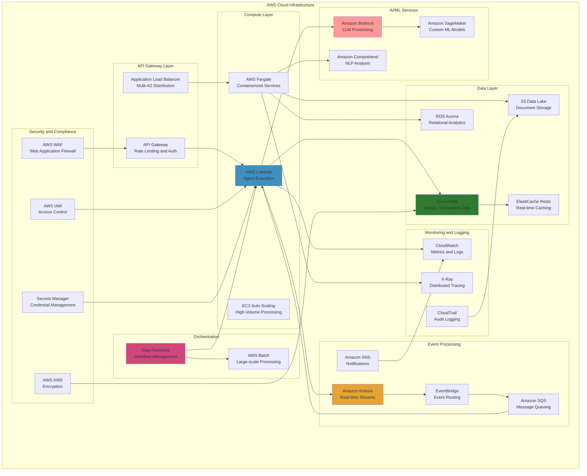

### **🔧 Technology Stack**

#### **Core Platform**
- **Runtime**: Python 3.9+ with async/await support
- **Orchestration**: LangGraph for multi-agent workflow management
- **AI/ML**: Amazon Bedrock (Claude, Titan), OpenAI GPT-4, Groq Llama
- **Event Processing**: Amazon Kinesis, EventBridge for real-time streaming

#### **Data & Storage**
- **NoSQL**: Amazon DynamoDB for high-performance transaction data
- **Object Storage**: Amazon S3 for documents and audit trails
- **Caching**: Redis for session state and frequently accessed data
- **Search**: Amazon OpenSearch for complex query capabilities

#### **Security & Compliance**
- **Encryption**: AES-256 encryption at rest and in transit
- **Access Control**: AWS IAM with least-privilege principles
- **Audit Logging**: Comprehensive CloudTrail and application logging
- **Data Privacy**: GDPR and regional compliance built-in

## 💡 **Risk Assessment Framework**

Our advanced risk scoring engine combines multiple risk factors with weighted algorithms to produce accurate, explainable risk assessments.

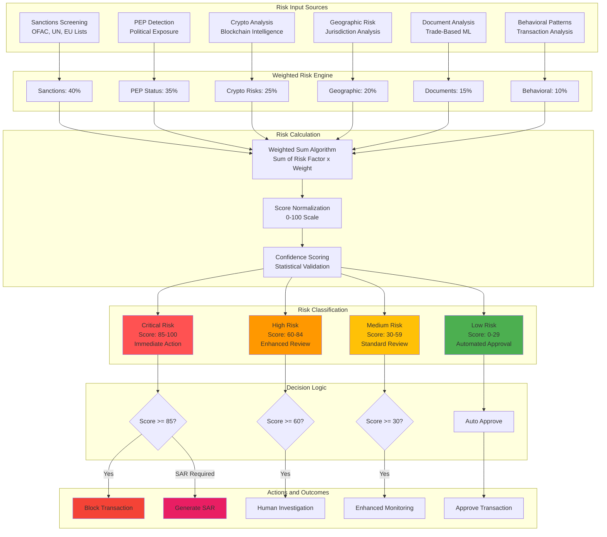

### **⚡ Risk Factor Weights**

| Risk Category | Weight | Description | Examples |
|---------------|--------|-------------|----------|
| **Sanctions Hit** | 40 | Entity matches sanctions lists | OFAC, UN, EU sanctions |
| **PEP Status** | 35 | Politically exposed person | Government officials, diplomats |
| **Crypto Risks** | 25 | Cryptocurrency-specific risks | Mixers, privacy coins, new wallets |
| **Geographic** | 20 | Jurisdictional risk factors | High-risk countries, tax havens |
| **Document** | 15 | Document-based risks | Invoice mismatches, trade anomalies |
| **Behavioral** | 10 | Pattern-based risks | Structuring, velocity anomalies |

## 🔬 **Cryptocurrency Analysis Engine**

Advanced blockchain analysis capabilities for detecting cryptocurrency-based money laundering activities with real-time risk assessment.

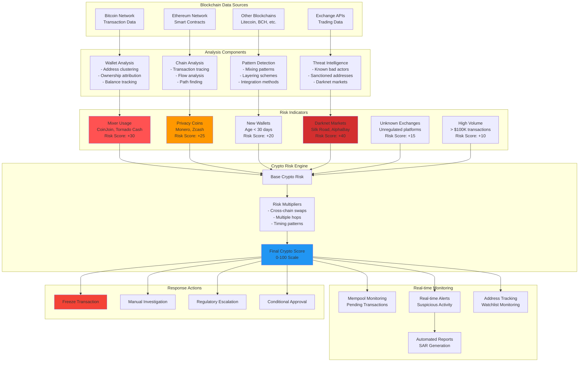

## 🚀 **Quick Start Guide**

### **📋 Prerequisites**
- Python 3.9 or higher
- AWS Account with appropriate permissions
- API keys for LLM providers (AWS Bedrock, OpenAI, or Groq)

### **⚡ Installation**

```bash
# Clone the repository
git clone https://github.com/your-org/ai-squadron-aml
cd ai-squadron-aml

# Create virtual environment
python -m venv venv
source venv/bin/activate  # On Windows: venv\Scripts\activate

# Install dependencies
pip install -r requirements.txt

# Configure environment
cp config/settings.py.example config/settings.py
# Edit config/settings.py with your API keys and AWS credentials
```

### **🔧 Configuration**

Create your configuration file:

```python
# config/settings.py
AWS_REGION = "us-east-1"
BEDROCK_MODEL_ID = "anthropic.claude-3-sonnet-20240229-v1:0"

# Optional: OpenAI Configuration
OPENAI_API_KEY = "your-openai-api-key"
OPENAI_MODEL = "gpt-4"

# Risk Thresholds
HIGH_RISK_THRESHOLD = 75
MEDIUM_RISK_THRESHOLD = 45
LOW_RISK_THRESHOLD = 25
```

### **🎯 Basic Usage**

```python
from src.core.aml_system import AMLSystem
from src.models.transaction import Transaction, CryptoDetails
from src.models.customer import Customer
from decimal import Decimal

# Initialize the AML system
aml_system = AMLSystem()
aml_system.start()

# Create a sample transaction
transaction = Transaction(
    transaction_id="TXN_001",
    amount=Decimal("75000"),
    currency="USD",
    asset_type="CRYPTO",
    sender_id="customer_123",
    receiver_id="exchange_456",
    origin_country="US",
    destination_country="CH",
    crypto_details=CryptoDetails(
        wallet_age_days=2,
        mixer_used=True,
        cross_chain_swaps=3
    )
)

# Create customer profile
customer = Customer(
    customer_id="customer_123",
    name="John Doe",
    account_age_days=45,
    risk_level="MEDIUM"
)

# Analyze the transaction
result = aml_system.analyze_transaction(transaction, customer)

# Review results
print(f"Risk Score: {result.risk_assessment.risk_score}/100")
print(f"Risk Level: {result.risk_assessment.risk_level}")
print(f"SAR Recommended: {result.sar_recommended}")
print(f"Requires Review: {result.requires_human_review}")

# Cleanup
aml_system.stop()
```

## 📊 **Advanced Examples**

### **🔄 Batch Processing**

```python
import asyncio
from src.core.aml_system import AMLSystem

async def batch_analysis():
    aml_system = AMLSystem()
    aml_system.start()
    
    # Prepare batch of transactions
    transactions_and_customers = [
        (transaction1, customer1),
        (transaction2, customer2),
        (transaction3, customer3)
    ]
    
    # Process batch asynchronously
    results = await aml_system.analyze_batch_async(transactions_and_customers)
    
    # Process results
    for result in results:
        if result.sar_recommended:
            print(f"SAR required for transaction: {result.transaction_id}")
    
    aml_system.stop()

# Run batch analysis
asyncio.run(batch_analysis())
```

### **🎨 Custom Risk Configuration**

```python
from src.core.risk_calculator import RiskCalculator

# Initialize with custom configuration
risk_calculator = RiskCalculator("config/custom_risk_parameters.yaml")

# Custom risk weights
custom_weights = {
    "sanctions_hit": 50,      # Increased weight for sanctions
    "pep_status": 40,         # Increased weight for PEPs
    "crypto_risks": 30,       # Higher crypto risk sensitivity
    "geographic_risks": 25,   # Enhanced geographic screening
    "behavioral_alerts": 15   # More sensitive to patterns
}

# Apply custom configuration
risk_calculator.update_weights(custom_weights)
```

### **📱 Real-time Monitoring Dashboard**

```python
from src.services.monitoring_service import MonitoringService

# Initialize monitoring
monitoring = MonitoringService()
monitoring.start()

# Get real-time metrics
metrics = monitoring.get_metrics()
print(f"Throughput: {metrics['performance']['throughput_per_hour']} transactions/hour")
print(f"SAR Rate: {metrics['aml_metrics']['sar_generated']}")

# Health check
health = monitoring.get_system_health()
if health["status"] != "HEALTHY":
    print(f"System Issues: {health['concerns']}")
```

## 🔍 **Detection Capabilities Deep Dive**

### **💰 Structuring & Smurfing Detection**

Advanced pattern recognition for detecting transaction structuring and smurfing activities with machine learning-enhanced algorithms.

### **📄 Trade-Based Money Laundering (TBML) Detection**

Sophisticated document analysis and trade pattern recognition to identify invoice manipulation and trade-based laundering schemes.

## 📈 **Performance & Technical Metrics**

### **⚡ System Performance**

| Metric | Target Value | Description |
|--------|-------------|-------------|
| **Throughput** | 1,000-5,000 TPS | Transactions processed per second (configurable) |
| **Latency** | 200-500ms | Average processing time per transaction |
| **Memory Usage** | 2-8GB | RAM requirements per instance |
| **CPU Usage** | 60-80% | Average CPU utilization under load |
| **Scalability** | Horizontal | Auto-scaling based on queue depth |

### **🎯 Detection Capabilities**

| Detection Type | Accuracy Range | Processing Time |
|----------------|----------------|-----------------|
| **Structuring** | 85-95% | 150-300ms |
| **Trade-Based ML** | 80-90% | 300-600ms |
| **Crypto Analysis** | 85-95% | 180-400ms |
| **PEP Detection** | 90-95% | 120-250ms |
| **Sanctions Screening** | 95-99% | 80-150ms |

## 🚀 **Deployment Architecture**

### **📦 Infrastructure as Code**

Deploy the complete AML system with Terraform templates for reproducible, scalable infrastructure.

```bash
# Deploy to AWS
cd deployment/terraform

# Initialize Terraform
terraform init

# Plan deployment
terraform plan -var-file="environments/production.tfvars"

# Deploy infrastructure
terraform apply -var-file="environments/production.tfvars"
```

### **🔧 Environment Configuration**

| Environment | Resources | Purpose | Access |
|-------------|-----------|---------|--------|
| **Development** | Minimal | Local testing | Developers |
| **Staging** | Limited | Integration testing | QA Team |
| **Production** | Full scale | Live transactions | Operations |

## 📊 **Monitoring & Observability**

Comprehensive monitoring and alerting system with real-time dashboards and automated anomaly detection.

### **📈 Key Performance Indicators**

- **Transaction Processing Rate**: Real-time TPS monitoring
- **Risk Detection Accuracy**: False positive/negative tracking  
- **System Latency**: End-to-end processing time
- **Alert Response Time**: Time to analyst review
- **Compliance Metrics**: SAR filing rates and timeline compliance

### **🚨 Automated Alerting**

- **Performance Degradation**: Automatic alerts for latency spikes
- **High Risk Detection**: Immediate notification for critical risks
- **System Health**: Proactive monitoring of all components
- **Capacity Planning**: Predictive scaling based on transaction volume

## 🧪 **Sample Data & Testing**

### **📊 Comprehensive Test Scenarios**

The system includes extensive test data covering various money laundering scenarios:

| Scenario Type | Test Cases | Risk Factors | Expected Outcome |
|---------------|------------|--------------|------------------|
| **Structuring** | Sub-threshold transactions | Multiple small amounts | High risk alert |
| **Trade-Based** | Invoice manipulation | Price/quantity mismatches | Document analysis alert |
| **Crypto Mixing** | Privacy coin usage | Mixer services, new wallets | Critical risk SAR |
| **PEP Transactions** | Political exposure | Government officials | Enhanced due diligence |
| **Cross-Border** | Complex routing | Multiple jurisdictions | Geographic risk alert |
| **Sanctions** | Prohibited entities | Blacklisted parties | Immediate blocking |

### **🧪 Testing Framework**

```python
# Run comprehensive test suite
python -m pytest tests/ -v

# Run specific scenario tests
python -m pytest tests/test_structuring.py
python -m pytest tests/test_crypto_analysis.py
python -m pytest tests/test_document_analysis.py

# Generate test reports
python scripts/generate_test_report.py
```

## 🔧 **Configuration Management**

### **⚙️ Environment-Specific Configuration**

```yaml
# config/environments/production.yaml
risk_thresholds:
  high_risk: 75
  medium_risk: 45
  low_risk: 25

llm_providers:
  primary: "bedrock"
  fallback: "openai"
  
monitoring:
  metrics_interval: 30
  alert_threshold: 95
  
compliance:
  sar_auto_filing: true
  audit_retention_days: 2555
```

### **🔐 Security Configuration**

```yaml
# config/security.yaml
encryption:
  at_rest: "AES-256"
  in_transit: "TLS-1.3"
  
access_control:
  mfa_required: true
  session_timeout: 3600
  
audit:
  log_level: "INFO"
  sensitive_data_masking: true
```

## 🆘 **Troubleshooting Guide**

### **⚠️ Common Issues**

| Issue | Symptoms | Solution |
|-------|----------|----------|
| **High Latency** | Processing >500ms | Check LLM API limits, scale Lambda |
| **False Positives** | Alert rate >5% | Adjust risk thresholds, retrain models |
| **Memory Issues** | Lambda timeouts | Increase memory allocation |
| **API Rate Limits** | 429 errors | Implement exponential backoff |

### **🔍 Debugging Commands**

```bash
# Check system health
python scripts/health_check.py

# View recent logs
aws logs tail /aws/lambda/aml-detection --follow

# Monitor metrics
python scripts/monitor_metrics.py --real-time

# Test specific transaction
python scripts/test_transaction.py --transaction-id TXN_123
```

## ❓ **Frequently Asked Questions**

### **🤔 General Questions**

**Q: How does the system handle false positives?**
A: The system uses continuous learning and analyst feedback to reduce false positives. Target rates vary by detection type and configuration.

**Q: Can the system process cryptocurrency transactions?**
A: Yes, the system includes cryptocurrency analysis capabilities including blockchain analysis, mixer detection, and privacy coin monitoring.

**Q: What's the maximum transaction volume?**
A: The system supports configurable throughput (1,000-5,000 TPS) with horizontal auto-scaling capabilities.

**Q: How long does analysis take?**
A: Processing time ranges from 200-500ms per transaction, depending on complexity and enabled detection modules.

### **🔧 Technical Questions**

**Q: Which LLM providers are supported?**
A: AWS Bedrock (Claude, Titan), OpenAI (GPT-4), and Groq (Llama models) with fallback capabilities.

**Q: How is data encrypted?**
A: All data is encrypted at rest (AES-256) and in transit (TLS 1.3) with AWS KMS key management.

**Q: Can the system integrate with existing core banking?**
A: Yes, through REST APIs, message queues, and real-time streaming interfaces.

## 🤝 **Contributing**

We welcome contributions from the community! Please read our [Contributing Guidelines](CONTRIBUTING.md) for details.

### **🔄 Development Workflow**

1. **Fork** the repository
2. **Create** a feature branch
3. **Implement** your changes
4. **Add** tests for new functionality
5. **Submit** a pull request

### **📋 Contribution Areas**

- **🔍 Detection Algorithms**: Improve existing or add new detection methods
- **🌐 Integrations**: Add support for new LLM providers or data sources
- **📊 Analytics**: Enhance monitoring and reporting capabilities
- **🔒 Security**: Strengthen security and compliance features
- **📚 Documentation**: Improve documentation and examples

## 📄 **License**

This project is licensed under the MIT License. See [LICENSE](LICENSE) file for details.

## 🏆 **Acknowledgments**

- **AWS** for providing cloud infrastructure and AI services
- **LangChain** for the innovative LangGraph framework
- **OpenAI** for advancing large language model capabilities
- **Financial Services Community** for regulatory guidance and requirements
- **Open Source Contributors** for continuous improvements and feedback

## 📞 **Support & Contact**

### **🎯 Technical Support**
- **Documentation**: Comprehensive guides in `/docs` folder
- **GitHub Issues**: Bug reports and feature requests
- **Discussion Forum**: Community Q&A and best practices

---

## 🚀 **Getting Started**

### **Quick Start**

```bash
git clone https://github.com/your-org/ai-squadron-aml
cd ai-squadron-aml
pip install -r requirements.txt
python -m src.main --demo
```

---

## 🧠 **Advanced AI & Machine Learning Pipeline**

The AI pipeline incorporates machine learning, graph neural networks, and advanced feature engineering.

### **🤖 AI Architecture**

This pipeline combines multiple AI techniques for enhanced detection:

- **🧠 Graph Neural Networks**: Detect complex transaction networks and money laundering communities
- **🎯 Active Learning**: Continuously improve with human analyst feedback
- **🔄 Federated Learning**: Share threat intelligence across institutions while preserving privacy
- **📊 Advanced Feature Engineering**: Extract sophisticated temporal, behavioral, and network features

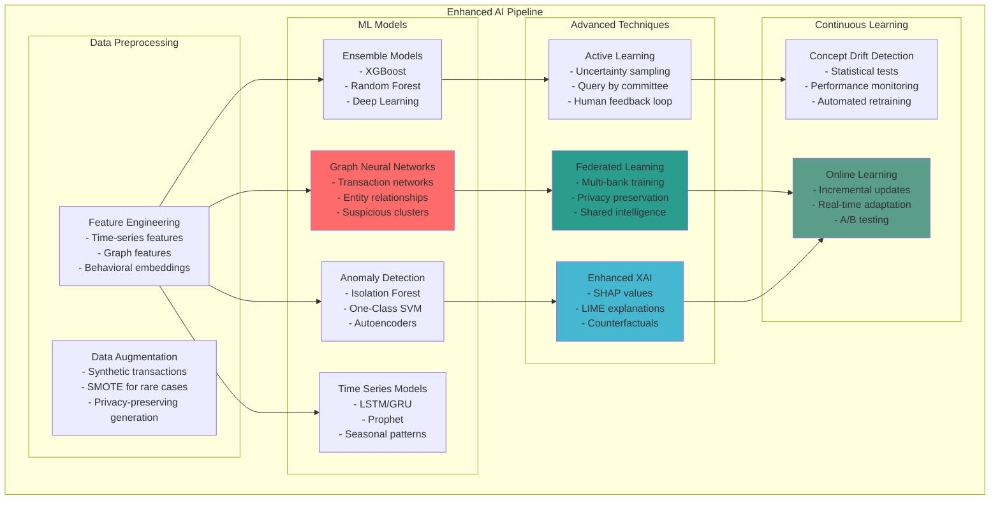

### **🕸️ Graph Neural Network Architecture**

Our GNN implementation focuses on community detection and network analysis for money laundering patterns:

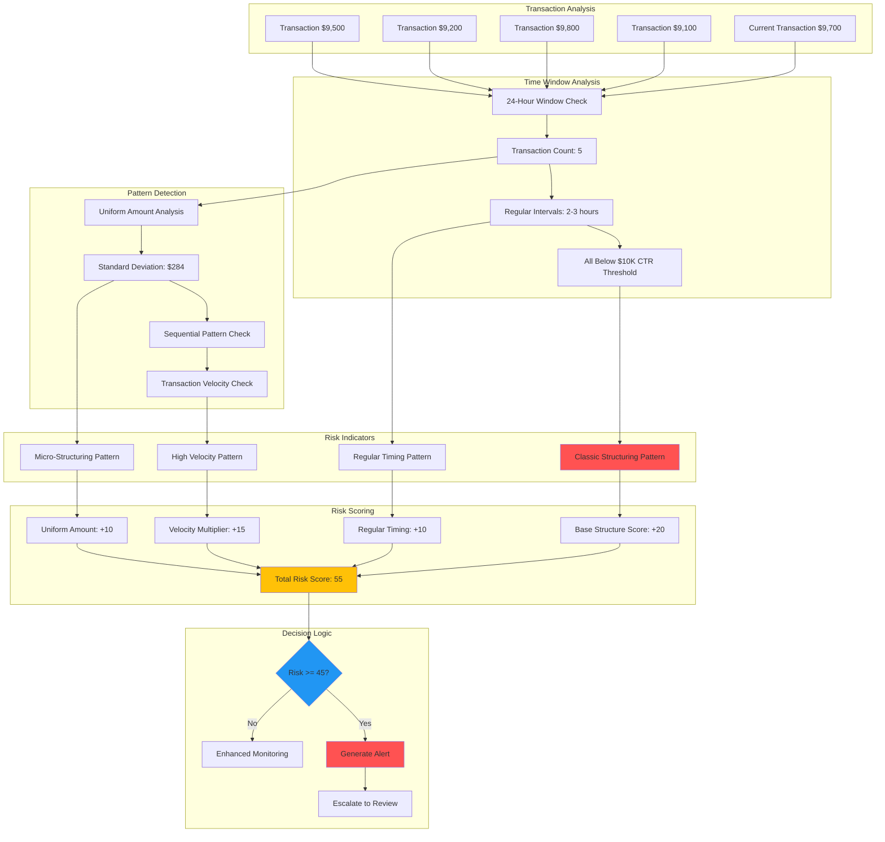

### **📄 Trade-Based Money Laundering Detection**

Advanced document analysis and pattern recognition for trade-based laundering schemes:

```mermaid
graph LR
    subgraph "Document Inputs"
        INVOICE[Commercial Invoice<br/>$500K for 1000 units silk]
        SHIPPING[Shipping Manifest<br/>1000 units silk]
        CUSTOMS[Customs Declaration<br/>Value: $300K]
        CONTRACT[Trade Contract<br/>Market price analysis]
    end
    
    subgraph "AI Document Analysis"
        OCR[Document OCR<br/>Text Extraction]
        NLP[NLP Processing<br/>Entity Recognition]
        LLM[LLM Analysis<br/>Contextual Understanding]
        PATTERN[Pattern Matching<br/>Risk Indicators]
    end
    
    subgraph "Discrepancy Detection"
        PRICE[Price Analysis<br/>Invoice vs Market]
        QUANTITY[Quantity Verification<br/>Invoice vs Shipping]
        VALUE[Value Comparison<br/>Invoice vs Customs]
        QUALITY[Quality Assessment<br/>Goods Description]
    end
    
    subgraph "TBML Risk Indicators"
        OVER[Over-Invoicing<br/>66% price inflation]
        UNDER[Under-Invoicing<br/>Customs undervaluation]
        PHANTOM[Phantom Shipment<br/>No actual goods]
        MISMATCH[Document Mismatch<br/>Inconsistent details]
    end
    
    subgraph "Risk Assessment"
        SCORE[TBML Risk Score]
        CLASSIFICATION[Risk Classification]
        RECOMMENDATION[Action Recommendation]
        ALERT[Generate Alert]
    end
    
    subgraph "Investigation Queue"
        ANALYST[Trade Analyst Review]
        VERIFICATION[Source Verification]
        ESCALATION[Regulatory Escalation]
        SAR[SAR Filing]
    end
    
    INVOICE --> OCR
    SHIPPING --> OCR
    CUSTOMS --> OCR
    CONTRACT --> OCR
    
    OCR --> NLP
    NLP --> LLM
    LLM --> PATTERN
    
    PATTERN --> PRICE
    PATTERN --> QUANTITY
    PATTERN --> VALUE
    PATTERN --> QUALITY
    
    PRICE --> OVER
    VALUE --> UNDER
    QUANTITY --> PHANTOM
    QUALITY --> MISMATCH
    
    OVER --> SCORE
    UNDER --> SCORE
    PHANTOM --> SCORE
    MISMATCH --> SCORE
    
    SCORE --> CLASSIFICATION
    CLASSIFICATION --> RECOMMENDATION
    RECOMMENDATION --> ALERT
    
    ALERT --> ANALYST
    ANALYST --> VERIFICATION
    VERIFICATION --> ESCALATION
    ESCALATION --> SAR
    
    style OVER fill:#ff5252
    style UNDER fill:#ff9800
    style PHANTOM fill:#f44336
    style SCORE fill:#4caf50
    style SAR fill:#ff1744
```

### **📊 Advanced Analytics & Business Intelligence Suite**

Comprehensive analytics platform providing real-time insights, predictive analytics, and strategic business intelligence:

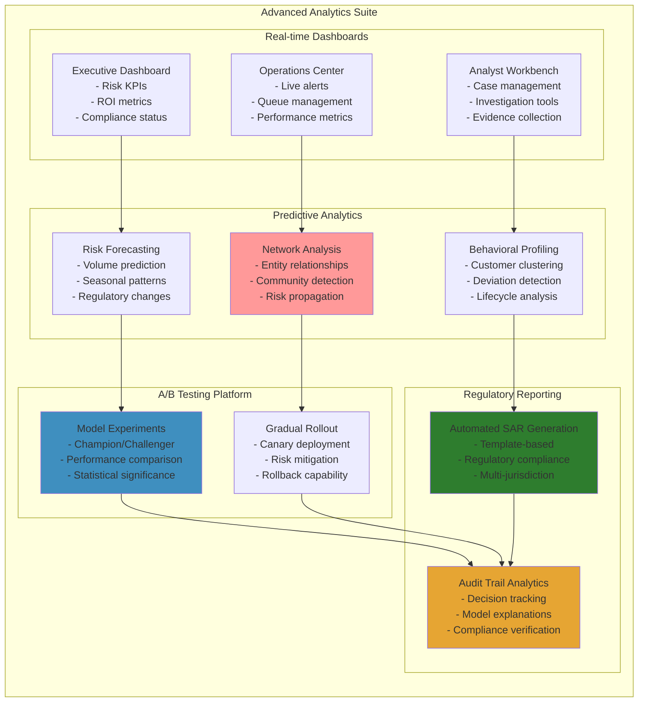

### **👁️ 360° Observability & Monitoring Stack**

Complete observability solution with intelligent alerting, distributed tracing, and anomaly detection:

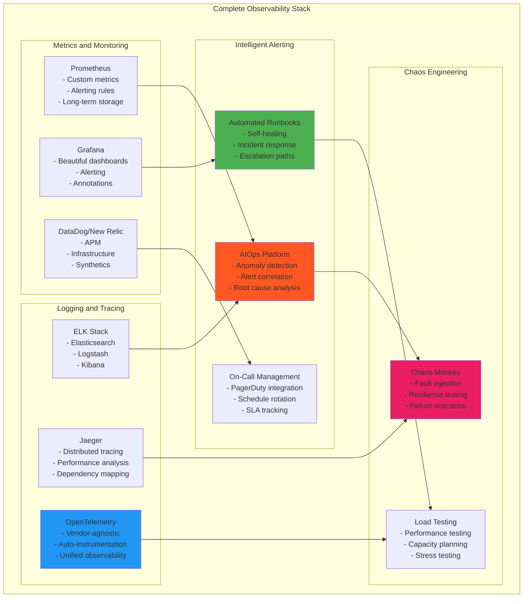

### **🌍 Multi-Environment Deployment Architecture**

Production-grade deployment architecture with multi-environment support and enterprise security:

```mermaid
graph TB
    subgraph "Multi-Environment Deployment"
        subgraph "Development Environment"
            DEV_API[Development API<br/>Single Instance]
            DEV_DB[Local DynamoDB<br/>Development Tables]
            DEV_LLM[Mock LLM Service<br/>Offline Testing]
        end
        
        subgraph "Staging Environment"
            STAGE_ALB[Application Load Balancer]
            STAGE_API[API Gateway<br/>Rate Limited]
            STAGE_LAMBDA[Lambda Functions<br/>Limited Concurrency]
            STAGE_DB[DynamoDB<br/>Staging Tables]
            STAGE_BEDROCK[Bedrock Access<br/>Limited Quota]
        end
        
        subgraph "Production Environment"
            subgraph "Global Infrastructure"
                PROD_CLOUDFRONT[CloudFront CDN<br/>Global Edge Locations]
                PROD_ALB[Application Load Balancer<br/>Multi-AZ]
                PROD_WAF[AWS WAF<br/>DDoS Protection]
            end
            
            subgraph "Compute Layer"
                PROD_API[API Gateway<br/>Production Scale]
                PROD_LAMBDA[Lambda Functions<br/>Auto-Scaling]
                PROD_FARGATE[Fargate Containers<br/>Long-Running Tasks]
                PROD_STEP[Step Functions<br/>Complex Workflows]
            end
            
            subgraph "Data Layer"
                PROD_DYNAMO[DynamoDB<br/>Global Tables]
                PROD_S3[S3 Buckets<br/>Multi-Region]
                PROD_REDIS[ElastiCache Redis<br/>Cluster Mode]
                PROD_RDS[RDS Aurora<br/>Multi-AZ]
            end
            
            subgraph "AI/ML Layer"
                PROD_BEDROCK[Amazon Bedrock<br/>High Throughput]
                PROD_COMPREHEND[Amazon Comprehend<br/>NLP Processing]
                PROD_SAGEMAKER[SageMaker<br/>Custom Models]
            end
            
            subgraph "Monitoring Layer"
                PROD_CLOUDWATCH[CloudWatch<br/>Metrics and Logs]
                PROD_XRAY[X-Ray<br/>Distributed Tracing]
                PROD_GRAFANA[Grafana Dashboard<br/>Custom Metrics]
            end
        end
    end
    
    subgraph "CI/CD Pipeline"
        GIT[Git Repository<br/>Source Code]
        BUILD[CodeBuild<br/>Automated Testing]
        DEPLOY[CodeDeploy<br/>Blue/Green Deployment]
        TERRAFORM[Terraform<br/>Infrastructure as Code]
    end
    
    subgraph "Security and Compliance"
        VAULT[AWS Secrets Manager<br/>Credential Storage]
        KMS[AWS KMS<br/>Encryption Keys]
        CLOUDTRAIL[CloudTrail<br/>Audit Logging]
        CONFIG[AWS Config<br/>Compliance Monitoring]
    end
    
    GIT --> BUILD
    BUILD --> DEPLOY
    TERRAFORM --> STAGE_API
    TERRAFORM --> PROD_API
    
    DEPLOY --> DEV_API
    DEPLOY --> STAGE_LAMBDA
    DEPLOY --> PROD_LAMBDA
    
    PROD_CLOUDFRONT --> PROD_ALB
    PROD_ALB --> PROD_API
    PROD_WAF --> PROD_ALB
    
    PROD_API --> PROD_LAMBDA
    PROD_LAMBDA --> PROD_FARGATE
    PROD_LAMBDA --> PROD_STEP
    
    PROD_LAMBDA --> PROD_DYNAMO
    PROD_LAMBDA --> PROD_S3
    PROD_LAMBDA --> PROD_REDIS
    PROD_STEP --> PROD_RDS
    
    PROD_LAMBDA --> PROD_BEDROCK
    PROD_LAMBDA --> PROD_COMPREHEND
    PROD_STEP --> PROD_SAGEMAKER
    
    PROD_LAMBDA --> PROD_CLOUDWATCH
    PROD_LAMBDA --> PROD_XRAY
    PROD_CLOUDWATCH --> PROD_GRAFANA
    
    VAULT --> PROD_LAMBDA
    KMS --> PROD_DYNAMO
    CLOUDTRAIL --> PROD_CLOUDWATCH
    CONFIG --> PROD_CLOUDWATCH
    
    style PROD_BEDROCK fill:#ff9999
    style PROD_LAMBDA fill:#3f8fbf
    style PROD_DYNAMO fill:#2e7d2e
    style PROD_CLOUDWATCH fill:#e6a533
    style TERRAFORM fill:#9c5aa3
```

### **🏢 Enterprise Integration Hub**

Comprehensive integration platform connecting with core banking systems, external data sources, and legacy infrastructure:

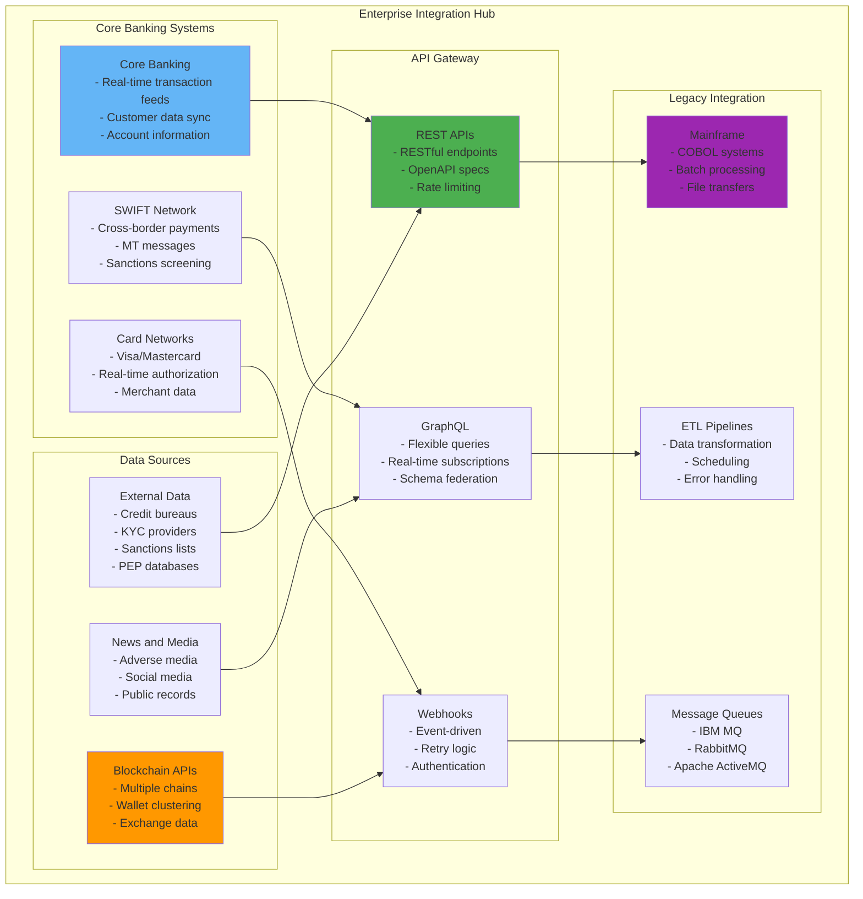

---

## 🛠️ **Technical Implementation Components**

### **Core System Components**
- Multi-agent AML detection architecture
- Graph Neural Networks for network analysis
- Real-time stream processing pipeline
- Advanced feature engineering
- Observability and monitoring stack

### **AI/ML Pipeline**
- Graph Neural Networks for community detection
- Active learning with analyst feedback
- Federated learning capabilities
- Advanced feature engineering
- Continuous model improvement

### **Infrastructure & Deployment**
- Multi-environment deployment support
- Container-based microservices
- Automated testing and CI/CD
- Comprehensive monitoring and logging
- Security and compliance framework

